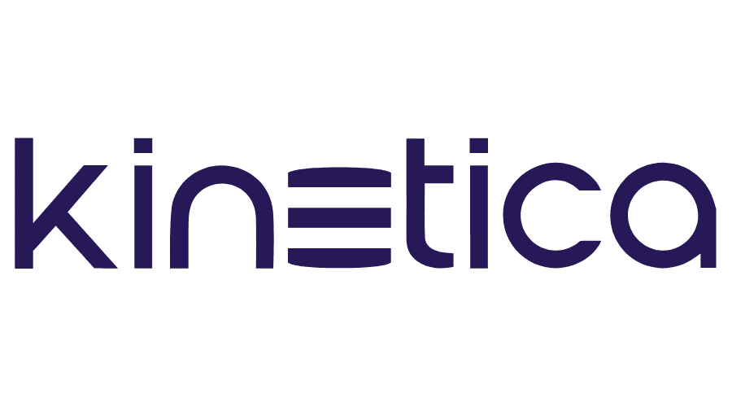
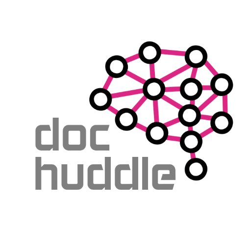
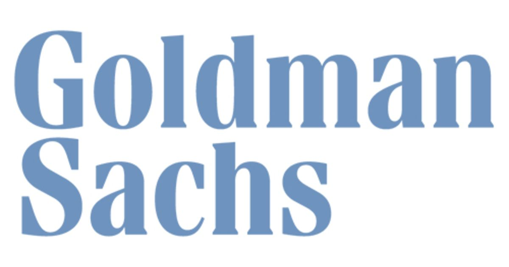
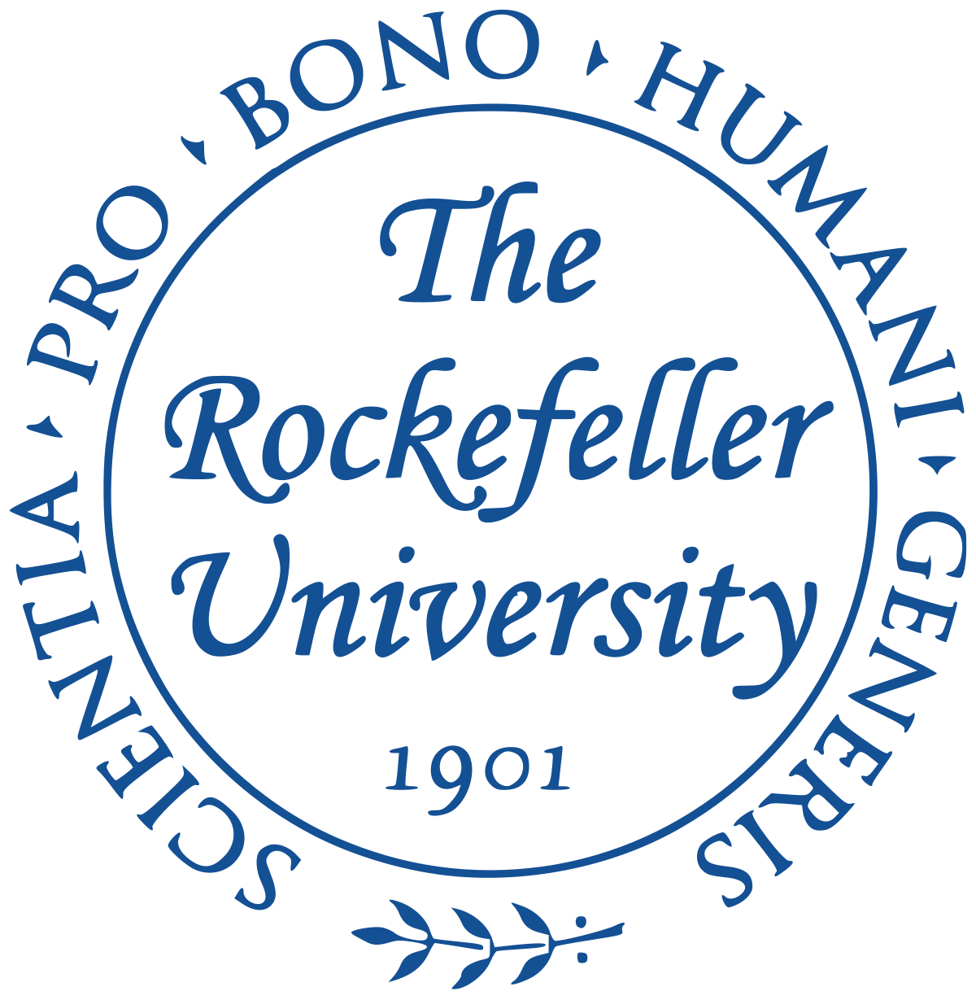

# hello world, its saif!

<!--
**saifrahmed/saifrahmed** is a ✨ _special_ ✨ repository because its `README.md` (this file) appears on your GitHub profile.

Here are some ideas to get you started:

- 🔭 I’m currently working on ...
- 🌱 I’m currently learning ...
- 👯 I’m looking to collaborate on ...
- 🤔 I’m looking for help with ...
- 💬 Ask me about ...
- 📫 How to reach me: ...
- 😄 Pronouns: ...
- ⚡ Fun fact: ...
-->

My name is Saif. I'm an accomplished product leader, quantitative platform developer, and ML practitioner who has consistently tackled tough, real-life problems and successfully delivered lasting platforms and solutions.

I'm especially good at balancing ground-level efforts with user interaction, stakeholder management, and organizational savvy to help deliver solutions which will be accepted and flourish in difficult enterprise settings. I have significant professional experience leading major strategic initiatives with complex quantitative/analytical components. I prefer being hands-on at least part of the time – analyzing data, prototyping solutions and working with teams on-the-ground.

Having done both Platform and Partner Engineering for over a decade, I bring deep ground-level experience instead of just applying theoretical enterprise architecture. Everything from evaluating components for correctness to facing Regulators to defend firm interests. My past work lives on -- at stock exchanges, global clearing facilities, banks, hedge funds, hospitals, and at US defense+intelligence facilities.

## Experience

| | | |
|:--:|:--:|:--:|
| </img> | [Kinetica](https://kinetica.com) | Director of Engineering, ML; Director of Developer Relations |
| </img> | [DocHuddle](https://www.dochuddle.com/) | Chief Technology Officer |
| </img> | [AIG Investments](https://www.aig.com/globalrealestate) |  Chief Quantitative Technologist |
| </img> | [Goldman Sachs](https://www.goldmansachs.com/) |  Sr. Associated, Derivatives X-Technology |
| </img> | [Accenture](https://accenture.com) |  Consultant, NY Capital Markets Group |

## Education
| | | |
|:--:|:--:|:--:|
| </img> |UC Berkeley | M.S. Information and Data Science |
| </img> |Cornell University | B.S. Computer Science |
| </img> |The Rockefeller University | Summer Fellow; SEED Fellow |

## Awards
* Bill Clinton Award for Academic Achievement
* Westinghouse Science Talent Search National Semifinalist
* Hal Varian Award winner for best capstone project: “DeepJams: ML Meets Music Composition”

## Select Talks & Publications

| | | | |
|:--:|:--:|:--:|:--:|
| *Conference* | NVIDIA Financial Services Forum 2019 | Asset management with modern ML and Graph techniques. Presented in London, December 2019. |
| *Conference* | TomTom ML Conf | Machine Learning on X-Rays for Low-Cost Tuberculosis Infection Detection - TomTom ML Conf |
| *Conference* | HIMSS-2017 | Machine Learning in Medicine - Organizational Setup and Enterprise Architecture. HIMSS-2017. |
| *Conference* | HIS 2015 | Infection Control via Augmented Reality. Hospital Infection Society, Annual Conference, HIS 2015. |
| *Book* | Machine Learning with TensorFlow. Co-author | PACKT Publishing, 2017 |

